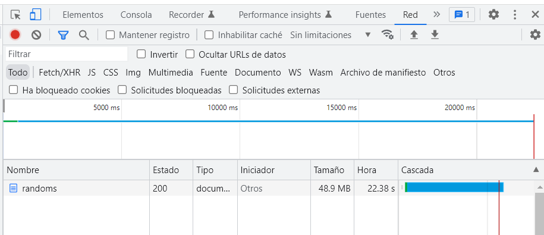
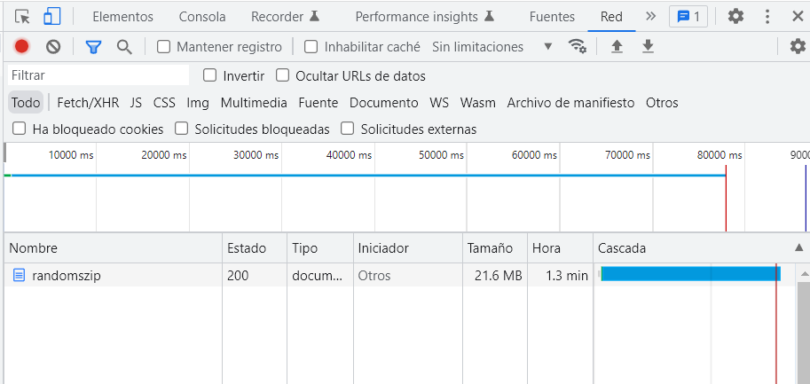

## Compression:
Para probar compression será necesario ejecutar la ruta: 
localhost:8080/randoms    (No usa compression)
localhost:8080/randomszip (Usa compression)

---

## Performance:
Para medir la performance, se usará para el caso de console log, el endpoint:
localhost:8080/infocl
Para el caso opuesto se utilizará el endpoint:
localhost:8080/info
Los resultados de las pruebas realizadas se encuentran dentro de la carpeta tests, las mismas estan documentadas tanto en imagenes como en documentos de texto.

---

## Conclusión:
En conclusión se puede decir que en aquellos casos en los que se uso el console.log(), no solo el proceso fue más lento, sino que también se ocuparon mas recursos para hacer la misma tarea que con un logger diferente. Creo que esta situación se debe a que el comando antes mencionado se ejecuta de manera sincrónica, por ende necesita mas recursos para ejecutarse.